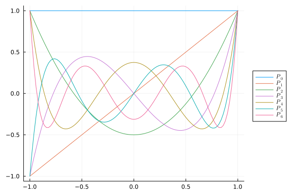

[toc]

# 1D burgurs equation

$$
\begin{equation}
  \begin{aligned}
    \frac{\partial u}{\partial t}+u\frac{\partial u}{\partial x}=0
  \end{aligned}
\end{equation}
$$

And it can also be written as:

$$
\begin{equation}
  \begin{aligned}
    \frac{\partial u}{\partial t}+
    \frac{\partial }{\partial x}\left(\frac{1}{2}u^2\right)=0
  \end{aligned}
\end{equation}
$$

in general, it has a form like:
$$
\begin{equation}
  \begin{aligned}
    \frac{\partial u}{\partial t}+\frac{\partial F(u)}{\partial x}=0
  \end{aligned}
\end{equation}
$$

# Interpolation

In domain $\Omega=[x_k,x_{j+1}]$ , we use a interpolation to approximate $u(t,x)$ as $\tilde{u}(t,x)$:

$$
\begin{equation}
  \begin{aligned}
    \tilde{u}=\sum_{j=1}^N a_j\phi_j
  \end{aligned}
\end{equation}
$$

while $\phi_j$ is a series orthogonal basis functions given by Legendre interpolation as below:

$$
\begin{equation}
\begin{cases}
  \begin{aligned}
  &\phi_0(\xi)=1\\
  &\phi_1(\xi)=\xi\\
  &\phi_2(\xi)=\frac{3}{2}\xi^2-\frac{1}{2}\\
  &\cdots
  \end{aligned}
\end{cases}
\end{equation}
$$

these series basis functions have a character as:
$$
\begin{equation}
\int_{-1}^1\phi_i(\xi)\phi_j(\xi)d\xi=
\begin{cases}
  \begin{aligned}
    &\frac{2}{2i+1}\quad i=j\\
    &0\quad i\neq j
  \end{aligned}
\end{cases}
\end{equation}
$$

you may see the detail information in file [scipyLegendre.ipynb](..//Legendre//scipyLegendre.ipynb) which gives the formulation from `scipy`. And file [LegpJulia.ipynb](..//Legendre//LegpJulia.ipynb) gives the function's plot using package `LegendrePolynomials`.  

<center>


Legendre Polynomials
</center>

# Galerkin Method

In the domain $\Omega$, make a transformation:

$$
\begin{equation}
  \begin{aligned}
    x=\frac{x_{k+1}-x_k}{2}\xi + \frac{x_{k}+x_{k+1}}{2}
  \end{aligned}
\end{equation}
$$

thus:

$$
\begin{equation}
  \begin{aligned}
    dx=h_k d\xi\quad,\quad h_k=\frac{x_{k+1}-x_k}{2}
  \end{aligned}
\end{equation}
$$

with Galerkin method we will have:
$$
\begin{equation}
  \begin{aligned}
    \int_{x_{k}}^{x_{k+1}}\phi_i(\xi)\left(
        \frac{\partial\tilde{u}}{\partial t}+
        \frac{\partial F(\tilde{u})}{\partial x}
    \right)dx=0\quad i=0,1,2\cdots ,N
  \end{aligned}
\end{equation}
$$

which can be written as:

$$
\begin{equation}
  \begin{aligned}
    \frac{\partial}{\partial t}\int_{-1}^{1}h_k\phi_i(\xi)\phi_j(\xi)\frac{\partial a_j}{\partial t}d\xi=
    -\int_{-1}^1\phi_i(\xi)\frac{\partial F(\tilde{u}(\xi))}{\partial \xi} d\xi
  \end{aligned}
\end{equation}
$$

use integrate by part:

$$
\begin{equation}
  \begin{aligned}
    \int_{-1}^1\phi_i(\xi)\frac{\partial F(\tilde{u}(\xi)) }{\partial \xi}d\xi=&F(\tilde{u}(1))\phi_i(1)-F(\tilde{u}(-1))\phi_i(-1)\\
    &-\int_{-1}^1 F(\tilde{u}(\xi)) \frac{d\phi_i(\xi)}{d\xi} d\xi
  \end{aligned}
\end{equation}
$$

so in general we will have a linear equation seen as (taken $N=3$ as example):

$$
\begin{equation}
\begin{aligned}
&\frac{\partial}{\partial t}
\left(h_k\int_{-1}^{1}
    \begin{bmatrix}
     \phi_0\phi_0 & \phi_0\phi_1 & \phi_0\phi_2\\
     \phi_1\phi_0 & \phi_1\phi_1 & \phi_1\phi_2\\
     \phi_2\phi_0 & \phi_2\phi_1 & \phi_2\phi_2
    \end{bmatrix}
d\xi\right)
\begin{bmatrix}
    a_0\\ a_1\\ a_2
\end{bmatrix}\\
&=-
\begin{bmatrix}
    F\left(\sum_{j=0}^2 a_j \phi_j(1)\right)\phi_0(1)-
    F\left(\sum_{j=0}^2 a_j \phi_j(-1)\right)\phi_0(-1)\\
    F\left(\sum_{j=0}^2 a_j \phi_j(1)\right)\phi_1(1)-
    F\left(\sum_{j=0}^2 a_j \phi_j(-1)\right)\phi_1(-1)\\
    F\left(\sum_{j=0}^2 a_j \phi_j(1)\right)\phi_2(1)-
    F\left(\sum_{j=0}^2 a_j \phi_j(-1)\right)\phi_2(-1)
\end{bmatrix}\\
&+\int_{-1}^1 F\left(\sum_{j=0}^2 a_j \phi_j(\xi)\right)
\begin{bmatrix}
    \frac{d\phi_0}{d\xi}\\
    \frac{d\phi_1}{d\xi}\\
    \frac{d\phi_2}{d\xi}
\end{bmatrix}d\xi
\end{aligned}
\end{equation}
$$

for $F(u)$ is usually so complicated to get its analytical solution,  gauss integration should be applied for $\int_{-1}^1 F(\tilde{u})\frac{d\phi_i}{d\xi} d\xi$. This in `julia` can use `dnPl` function to attain $d_{\xi}\phi_i(\xi)$ .

# Things prepared in calculation

Here're some things should be prepared before calculation. Take $N=3$ as example, we need:

## Mass Matrix

Mass matrix $\int \phi_i\phi_j d\xi$ should be generated before calculation. For the orthogonality of basis function, only a vector should be stored in memory:

```julia
mass_vector::Vector{Float64} = 2 / (LinRange(0, n_gauss-1) .* 2 .+ 1)
```

## Gauss integral points

When $N=3$, which means there're 3 gauss integral  points in the domain. Denote the 3 points as $\eta_{1,2,3}$ and the weight be $w_{1,2,3}$. Thus a integral in the domain can be approximate with:

$$
\begin{equation}
  \begin{aligned}
    \int_{-1}^1 f(\xi)d\xi=
    \sum_{j=1}^N f(\eta_j)w_j
  \end{aligned}
\end{equation}
$$

of course here we should have the value of:

$$
\begin{equation}
  \begin{aligned}
    [\phi_j(\eta_i)]=
    \begin{bmatrix}
        \phi_1(\eta_1)& \phi_2(\eta_1)& \phi_3(\eta_1)\\
        \phi_1(\eta_2)& \phi_2(\eta_2)& \phi_3(\eta_2)\\
        \phi_1(\eta_3)& \phi_2(\eta_3)& \phi_3(\eta_3)
    \end{bmatrix}
  \end{aligned}
\end{equation}
$$

denote the 2 order tensor below as $\theta_{ij}=\phi_j(\eta_i)$, and we will have:

$$
\begin{equation}
  \begin{aligned}
    \tilde{u}(\eta_i)=\tilde{u}_i=\theta_{ij}a_j
  \end{aligned}
\end{equation}
$$

in `Julia`, the $\theta_{ij}$ can be generated easily by:

```julia
theta_matrix::Matrix{Float64} = legp.Pl.(gauss_points, Vector(0: n_gauss-1)')
```

## At boundary

We need a series value of $\phi_j(\xi)$ at boundary $\xi=-1,1$. Deonte as `phi_lrhs`.

```julia
phi_lrhs::Matrix{Float64} = legp.Pl.([-1., 1.], Vector(0: n_gauss-1)')
```

## 1-order derivative of basis function

in part $\frac{d\phi_j}{d\xi}$ we could use `dnPl` to attain its value, denote as:

$$
\begin{equation}
  \begin{aligned}
    \theta^{(1)}_{ij}=\frac{d\phi_j(\xi)}{d\xi}
    \large|_{\xi=\eta_i}
  \end{aligned}
\end{equation}
$$

```julia
theta_1D::Matrix{Float64} = legp.dnPl.(gauss_points, Vector(0: n_gauss-1)', 1)
```

bottom line
---