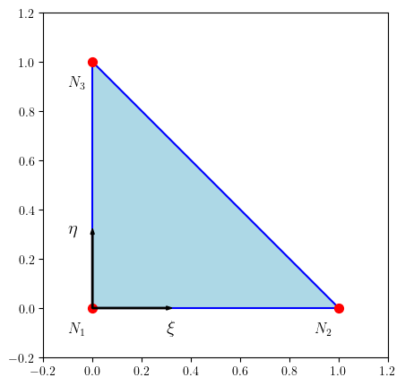
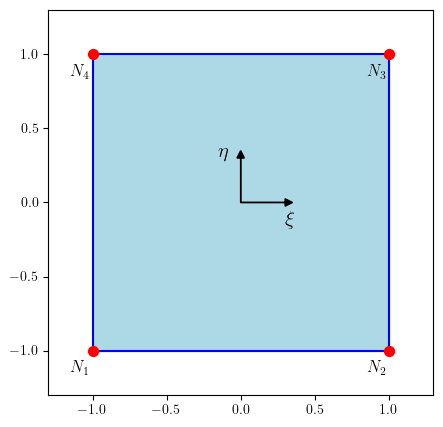
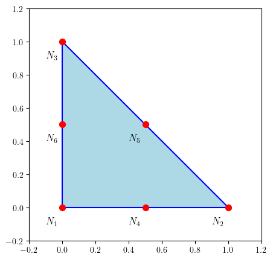

# Euler Equation

In Euler equation, we will have a vector PDE looks like:

$$
\frac{\partial u}{\partial t} + \frac{\partial f_i(u)}{\partial x_i} = 0
$$

In 2D case, we could write it as:

$$
\frac{\partial u}{\partial t} +  \frac{\partial f_x(u)}{\partial x} + \frac{\partial f_y(u)}{\partial y} = 0
$$

for convenience, we could write it as:

$$
u_t+f_x(u)_x+f_y(u)_y=0
$$

where $f_x(u)$ and $f_y(u)$ are fluxes in $x$ and $y$ directions. Thus the PDE can also be written as:

$$
u_t+\nabla\cdot\vec{f}(u)=0
$$

# Interpolation in Tri-element

Take 2-p order Lagrange polynomial as example, we have:

$$
\tilde{u}(x,y)=\sum_{j=1}^6 \phi_j(x,y)u_j
$$

where $u_j$ is the value of $u$ at the $j$-th node, and $\phi_j(x,y)$ is the basis function at the $j$-th node.

For convenience, we could write it with Einstein notation:

$$
\tilde{u}(x,y)=\phi_j u_j
$$

where $\phi_j$ is a scalar function of $x$ and $y$.

This also works in quad-element.

# Galerkin Method

In Galerkin method, we will have:

$$
\int_\Omega \phi_i u_t d\Omega + \int_\Omega \phi_i \nabla\cdot\vec{f}(u) d\Omega = 0\quad i=1,2,\cdots,N_k
$$

where $N_k$ is the number of nodes in the $k$-th element. $N_k=6$ for 2-order DG tri-element.

Let $u(x,y)\approx\tilde{u}(x,y)=\phi_j u_j$, we will have:

$$
\int_\Omega \phi_i \phi_j u_{j,t} d\Omega + \int_\Omega \phi_i \nabla\cdot\vec{f}(\phi_j u_j) d\Omega = 0\quad i=1,2,\cdots,N_k
$$

Let's consider a integral of the form:

$$
\int_\Omega \varphi\nabla\cdot\vec{A}d\Omega=
\int_{\partial\Omega}\varphi\vec{A}\cdot\vec{n}ds-
\int_\Omega\vec{A}\cdot\nabla\varphi d\Omega
$$

Thus the above equation can be written as:

$$
\int_\Omega \phi_i \phi_j u_{j,t} d\Omega =
\int_\Omega\vec{f}(\phi_j u_j)\cdot\nabla\phi_i d\Omega-
\int_{\partial\Omega}\phi_i\vec{f}(\phi_j u_j)\cdot\vec{n}ds
\quad i=1,2,\cdots,N_k
$$

Let's see the lhs. We have:

$$
\int_\Omega \phi_i \phi_j u_{j,t} d\Omega=
\left(\int_\Omega \phi_i \phi_j d\Omega\right)
\frac{\partial u_j}{\partial t}
$$

In time discretization, we have:

$$
\frac{\partial u_j}{\partial t}\approx\frac{u_j^{n+1}-u_j^n}{\Delta t}
$$

Thus we have:

$$
\int_\Omega \phi_i \phi_j u_{j,t} d\Omega=
\left(\int_\Omega \phi_i \phi_j d\Omega\right)
\frac{u_j^{n+1}-u_j^n}{\Delta t}
$$

the part $\int_\Omega \phi_i \phi_j d\Omega$ is the mass matrix, which is a constant matrix for a given domain (element). Let's denote it as $M_{ij}$.

For the rhs, the first term is a volume integral:

$$
\int_\Omega\vec{f}(\phi_j u_j)\cdot\nabla\phi_i d\Omega=
\sum_k^{N_P}\omega_k\vec{f}(\phi_j(x_k,y_k)u_j) \cdot \nabla\phi_i(x_k,y_k)
$$

In this part $\nabla\phi_i$ is needed. This integral in DG method is usually calculated by Gauss quadrature. Thus we need $\phi_j(x,y)$'s value at the Gauss points $(x_k,y_k)$ as well as $\nabla\phi_i(x,y)$'s value at the Gauss points.

The second term is a surface integral:

$$
\int_{\partial\Omega}\phi_i\vec{f}(\phi_j u_j)\cdot\vec{n}ds=
\sum_{\partial\Omega}\phi_i\vec{f}(\phi_j u_j)\cdot\vec{n}ds
$$

Also this integral is calculated by Gauss quadrature. Thus we need $\phi_j(x,y)$'s value at the Gauss points $(x_k,y_k)$ as well as $\vec{f}(\phi_j u_j)$'s value at the Gauss points. However, this part should applied some schemes to calculate the flux at the boundary. For example, we could use the upwind scheme or Roe scheme to get the flux at the boundary.

# Jacobian Matrix

Integral for different element is different. Thus we could apply a transformation from global coordinate $(x,y)$ to local coordinate $(\xi,\eta)$. In this way, we could calculate the integral in local coordinate.

Let's see such transformation in tri-element:

$$
\begin{bmatrix}
x\\ y
\end{bmatrix}=
\begin{bmatrix}
A_1 + A_2\xi + A_3\eta\\
B_1 + B_2\xi + B_3\eta
\end{bmatrix}
$$

where $A_i$ and $B_i$ are constants. Thus we have:

$$
\begin{bmatrix}
\frac{\partial x}{\partial \xi} & \frac{\partial x}{\partial \eta}\\
\frac{\partial y}{\partial \xi} & \frac{\partial y}{\partial \eta}
\end{bmatrix}=
\begin{bmatrix}
A_2 & A_3\\
B_2 & B_3
\end{bmatrix}
$$

Such transformation can also be written as:

$$
\begin{bmatrix}
x\\ y
\end{bmatrix}=
\begin{bmatrix}
A_2 & A_3\\
B_2 & B_3
\end{bmatrix}
\begin{bmatrix}
\xi\\ \eta
\end{bmatrix}+
\begin{bmatrix}
A_1\\ B_1
\end{bmatrix}
$$

which has clear physical meaning. $\begin{bmatrix}A_2 & A_3\\ B_2 & B_3\end{bmatrix}$ is the Jacobian matrix, which represents affine transformation and rotational transformation. $\begin{bmatrix}A_1\\ B_1\end{bmatrix}$ is the translation vector.

A reference tri-element is shown below:

For quad-element, the transformation from $(x,y)$ to $(\xi,\eta)$ is different:

$$
\begin{bmatrix}
x\\ y
\end{bmatrix}=
\begin{bmatrix}
A_0 + A_1\xi + A_2\eta + A_3\xi\eta\\
B_0 + B_1\xi + B_2\eta + B_3\xi\eta
\end{bmatrix}
$$

A reference quad-element is shown below:

# Mass Matrix (Order 2 in Tri-element as Example)

Considering a order-2 tri-element, we have 6 nodes below:

## Base Functions

The base functions are:

$$
\tilde{u}(\xi, \eta) =
a_0 + a_1 \xi + a_2 \eta + a_3 \xi^2 + a_4 \xi \eta + a_5 \eta^2
$$

The coefficients are ensured by the following conditions:

$$
u_j = \tilde{u}(\xi_j, \eta_j)\quad j = 1, 2, 3
$$

which satisfies:

$$
\begin{bmatrix}
u_1\\ u_2\\ u_3\\ u_4\\ u_5\\ u_6
\end{bmatrix}=
\begin{bmatrix}1 & 0 & 0 & 0 & 0 & 0\\1 & 1 & 0 & 1 & 0 & 0\\1 & 0 & 1 & 0 & 0 & 1\\1 & \frac{1}{2} & 0 & \frac{1}{4} & 0 & 0\\1 & \frac{1}{2} & \frac{1}{2} & \frac{1}{4} & \frac{1}{4} & \frac{1}{4}\\1 & 0 & \frac{1}{2} & 0 & 0 & \frac{1}{4}\end{bmatrix}
\begin{bmatrix}
a_0\\ a_1\\ a_2\\ a_3\\ a_4\\ a_5
\end{bmatrix}
$$

Thus $\tilde{u}(\xi, \eta)$ can be written as:

$$
\begin{aligned}
\tilde{u}(\xi, \eta)
&= \begin{bmatrix}1 & \xi & \eta & \xi^2 & \xi \eta & \eta^2\end{bmatrix}
\begin{bmatrix}
a_0\\ a_1\\ a_2\\ a_3\\ a_4\\ a_5
\end{bmatrix}\\
&=\begin{bmatrix}1 & \xi & \eta & \xi^2 & \xi \eta & \eta^2\end{bmatrix}
\begin{bmatrix}1 & 0 & 0 & 0 & 0 & 0\\1 & 1 & 0 & 1 & 0 & 0\\1 & 0 & 1 & 0 & 0 & 1\\1 & \frac{1}{2} & 0 & \frac{1}{4} & 0 & 0\\1 & \frac{1}{2} & \frac{1}{2} & \frac{1}{4} & \frac{1}{4} & \frac{1}{4}\\1 & 0 & \frac{1}{2} & 0 & 0 & \frac{1}{4}\end{bmatrix}^{-1}
\begin{bmatrix}
u_1\\ u_2\\ u_3\\ u_4\\ u_5\\ u_6
\end{bmatrix}\\
&=
\begin{bmatrix} \phi_1 & \phi_2 & \phi_3 & \phi_4 & \phi_5 & \phi_6\end{bmatrix}
\begin{bmatrix}
u_1\\ u_2\\ u_3\\ u_4\\ u_5\\ u_6
\end{bmatrix}
\end{aligned}
$$

## Shape Functions

we get the shape functions $\phi_j(\xi,\eta)$ :

$$
\begin{bmatrix}
\phi_1 \\ \phi_2 \\ \phi_3 \\ \phi_4 \\ \phi_5 \\ \phi_6
\end{bmatrix}=
\begin{bmatrix}2 \eta^{2} + 4 \eta \xi - 3 \eta + 2 \xi^{2} - 3 \xi + 1\\\xi \left(2 \xi - 1\right)\\\eta \left(2 \eta - 1\right)\\4 \xi \left(- \eta - \xi + 1\right)\\4 \eta \xi\\4 \eta \left(- \eta - \xi + 1\right)\end{bmatrix}
$$

shape fucntion $\phi_j$ should be $1$ at $(\xi_j, \eta_j)$ and $0$ at $(\xi_k, \eta_k)$ where $k \neq j$.

## Mass Matrix

In discontinuous galerkin method, $\int_\Omega \phi_i(x,y)\phi_j(x,y)d\Omega$ is needed. While in reference triangle, the integral can be transfered to:

$$
\int_\Omega \phi_i(x,y)\phi_j(x,y)d\Omega=
\int_{\Omega} |J| \phi_i(\xi,\eta)\phi_j(\xi,\eta)d\xi d\eta
$$

For tri-element, $|J|$ is constant, thus only $\phi_i\phi_j$'s integral is needed as below.

$$
\begin{bmatrix}\frac{1}{60} & - \frac{1}{360} & - \frac{1}{360} & 0 & - \frac{1}{90} & 0\\- \frac{1}{360} & \frac{1}{60} & - \frac{1}{360} & 0 & 0 & - \frac{1}{90}\\- \frac{1}{360} & - \frac{1}{360} & \frac{1}{60} & - \frac{1}{90} & 0 & 0\\0 & 0 & - \frac{1}{90} & \frac{4}{45} & \frac{2}{45} & \frac{2}{45}\\- \frac{1}{90} & 0 & 0 & \frac{2}{45} & \frac{4}{45} & \frac{2}{45}\\0 & - \frac{1}{90} & 0 & \frac{2}{45} & \frac{2}{45} & \frac{4}{45}\end{bmatrix}
$$

# Volume Intgral (Order 2 in Tri-element as Example)

Another part in discontinuous galerkin method is the volume integral $\int_\Omega\vec{f}(\phi_j u_j)\cdot\nabla\phi_i d\Omega$. In this part, we need $\nabla\phi_i$'s value at the Gauss points $(x_k,y_k)$ as well as $\phi_j(x,y)$'s value at the Gauss points.

## $\nabla \phi_i$'s value

$$
\nabla \phi_i = \frac{\partial \phi_i}{\partial x} \vec{e}_x + \frac{\partial \phi_i}{\partial y} \vec{e}_y
$$

For $\phi_{i,x}$ we use chain rule:

$$
\frac{\partial \phi_i}{\partial x} = \frac{\partial \phi_i}{\partial \xi} \frac{\partial \xi}{\partial x} + \frac{\partial \phi_i}{\partial \eta} \frac{\partial \eta}{\partial x}
$$